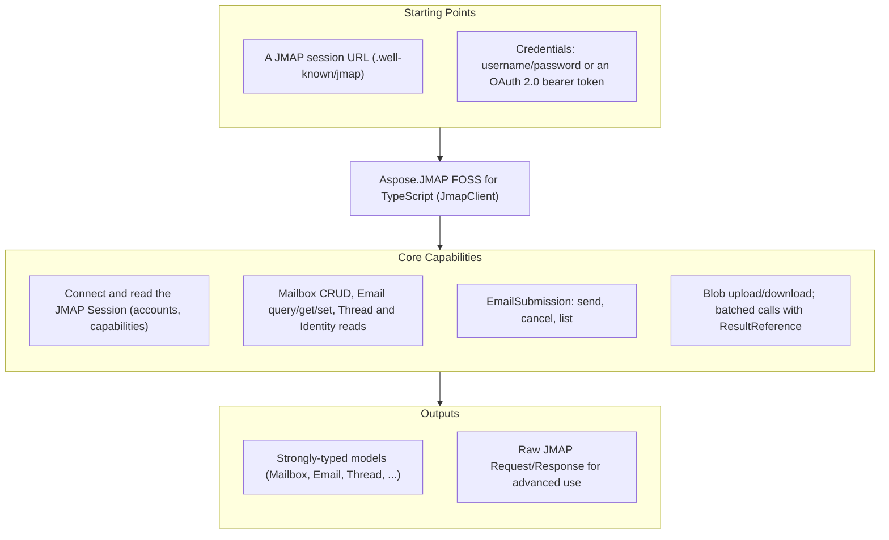

# Aspose.JMAP FOSS for TypeScript

[](LICENSE) [](https://github.com/aspose-email-foss/Aspose.JMAP-FOSS-for-TypeScript/graphs/contributors)

Aspose.JMAP FOSS for TypeScript is a free, open source JMAP client library with first-class type
definitions — for talking to a [JMAP](https://jmap.io) mail server over HTTP:
[RFC 8620](https://www.rfc-editor.org/rfc/rfc8620) Core (session, `Core/echo`, blob
upload/download, batched method calls) and [RFC 8621](https://www.rfc-editor.org/rfc/rfc8621)
Mail (Mailbox/Email/Thread/Identity/SearchSnippet) plus EmailSubmission. Its public API is
styled after Aspose.Email's client conventions — a client object plus a typed options
interface, a `connect()` lifecycle, and strongly-typed message and folder models — and it ships
with no runtime dependencies (it uses the built-in `fetch`).

**This is an official Aspose open-source project. It does not contain or reference Aspose.Email
proprietary source.** The library is generated from hand-authored JMAP protocol specifications.

## Navigation

- [At a Glance](#at-a-glance)
- [Key Capabilities](#key-capabilities)
- [Installation](#installation)
- [Dependencies](#dependencies)
- [Quick Start](#quick-start)
- [Additional Examples](#additional-examples)
- [API Reference](#api-reference)
- [Documentation & Resources](#documentation--resources)
- [Scope and Limitations](#scope-and-limitations)
- [Development and Testing](#development-and-testing)
- [License](#license)

## At a Glance



## Key Capabilities

- **Connect and inspect the session** — `client.connect()` fetches `/.well-known/jmap` and
  returns the session (account ids, `capabilities`, `apiUrl`, `uploadUrl`, `downloadUrl`).
- **Mailboxes** — `listMailboxes()`, `getMailbox()`, `createMailbox()`, `deleteMailbox()` wrap
  `Mailbox/get`, `Mailbox/query`, and `Mailbox/set`.
- **Messages** — `listMessages()`, `fetchMessage()`, `moveMessage()`, `setMessageKeyword()`,
  `deleteMessage()` over `Email/query`, `Email/get`, and `Email/set`.
- **Identities** — `listIdentities()` over `Identity/get`.
- **Sending** — `send()`, `cancelSend()`, `listSubmissions()` wrap `EmailSubmission/set` and
  `EmailSubmission/get`.
- **Blobs** — `uploadBlob()` / `downloadBlob()` for `/upload` and `/download`.
- **Batching** — `sendRequest()` sends any list of `Invocation`s in one HTTP round trip, with
  `ResultReference` ([RFC 8620 §3.7](https://www.rfc-editor.org/rfc/rfc8620#section-3.7)) to
  chain one call's result into the next.
- **Pluggable transport** — a stub `fetch` implementation can be injected, so no unit test needs
  a network.
- **OAuth 2.0** — a `bearerToken` option ([RFC 6750](https://www.rfc-editor.org/rfc/rfc6750)) as
  an alternative to HTTP Basic.

## Installation

No package has been published to npm yet; until it is, build the library from source (see
[Development and Testing](#development-and-testing)). The intended published id is
`aspose-jmap-foss-ts`:

```bash
npm install aspose-jmap-foss-ts
```

The package ships `.d.ts` type definitions and targets Node.js 18 or later (for the built-in
`fetch`); the source compiles with a standard `tsconfig` (`tsc`).

## Dependencies

### Required Package Dependencies

None. The client uses the global `fetch` from Node.js 18+; there are no `dependencies` in
`package.json`.

### Native and System Requirements

- Node.js 18.0.0 or later.

### Development Dependencies

- `typescript` — to compile the sources. Tests run on the built-in `node --test` runner against
  the compiled output.

## Quick Start

```typescript
import { JmapClient, JmapClientOptions } from "aspose-jmap-foss-ts";

const options: JmapClientOptions = {
  sessionUrl: "https://jmap.example.test/.well-known/jmap",
  username: "user@example.test",
  password: "secret",
};
const client = new JmapClient(options);
const session = await client.connect();
```

## Additional Examples

### OAuth 2.0 bearer token authentication

Authenticate with an OAuth 2.0 bearer token
([RFC 6750](https://www.rfc-editor.org/rfc/rfc6750)) by supplying `bearerToken` instead of HTTP
Basic credentials (in which case `username`/`password` are ignored):

```typescript
const options: JmapClientOptions = {
  sessionUrl: "https://jmap.example.test/.well-known/jmap",
  username: "",
  password: "",
  bearerToken: "eyJhbGciOi...", // OAuth access token
};
const client = new JmapClient(options);
const session = await client.connect();
```

<details>
<summary>Batching requests with ResultReference</summary>

Multiple method calls can be batched into a single HTTP round trip via `sendRequest`, using a
`ResultReference` ([RFC 8620 §3.7](https://www.rfc-editor.org/rfc/rfc8620#section-3.7)) to chain
a later call to an earlier one's result without a second request:

```typescript
import { Invocation, ResultReference } from "aspose-jmap-foss-ts";

const query = new Invocation({ name: "Email/query", arguments: { accountId }, methodCallId: "c1" });
const get = new Invocation({
  name: "Email/get",
  arguments: {
    accountId,
    "#ids": new ResultReference({ resultOf: "c1", name: "Email/query", path: "/ids" }).toJson(),
  },
  methodCallId: "c2",
});
const resp = await client.sendRequest([query, get], ["urn:ietf:params:jmap:mail"]);
```

</details>

## API Reference

`JmapClient` (with the `JmapClientOptions` interface) is the single entry point; the model
types `Session`, `Mailbox`, `Email`, `EmailAddress`, `Thread`, `Identity`, `EmailSubmission`,
and `SearchSnippet` mirror the JMAP objects one-to-one, and `Invocation` / `ResultReference`
model raw method calls for `sendRequest`. Errors surface as `JmapNetworkError` (transport) and
`JmapProtocolError` (a JMAP method-level error); per-item `Set` failures are returned as data on
the result object rather than thrown.

The protocol/API reference is generated from the same specifications that drive this library.

## Documentation & Resources

- Found a bug or have a feature request? [Open an issue](https://github.com/aspose-email-foss/Aspose.JMAP-FOSS-for-TypeScript/issues) on GitHub.

## Scope and Limitations

- **Protocol**: JMAP Core (RFC 8620) and JMAP Mail (RFC 8621: Mailbox/Email/Thread/Identity/SearchSnippet)
  plus EmailSubmission.
- **Out of scope for v1**:
  - Push / `EventSource` streaming — the type exists but is a stub/no-op.
  - JMAP for Calendars and Contacts.
  - `Date`/`UTCDate` values are kept as raw RFC 3339 strings (no `Date` parsing) to avoid
    timezone-conversion bugs.
- Unit tests run against a stub `fetch` with mocked responses — no live JMAP server is required.
  A Docker-based live-server integration suite (Stalwart Mail Server) lives in
  a separate Docker-based live-server suite used during release validation.

## Development and Testing

```bash
git clone https://github.com/aspose-email-foss/Aspose.JMAP-FOSS-for-TypeScript.git
cd Aspose.JMAP-FOSS-for-TypeScript
npm install
npm test
```

Live-server integration testing is maintained separately from this distribution repository.

## License

This project is licensed under the [MIT License](LICENSE). The MIT License permits use, copying,
modification, distribution, sublicensing, and commercial use, provided its copyright and
permission notice are retained. The software is provided without warranty.
